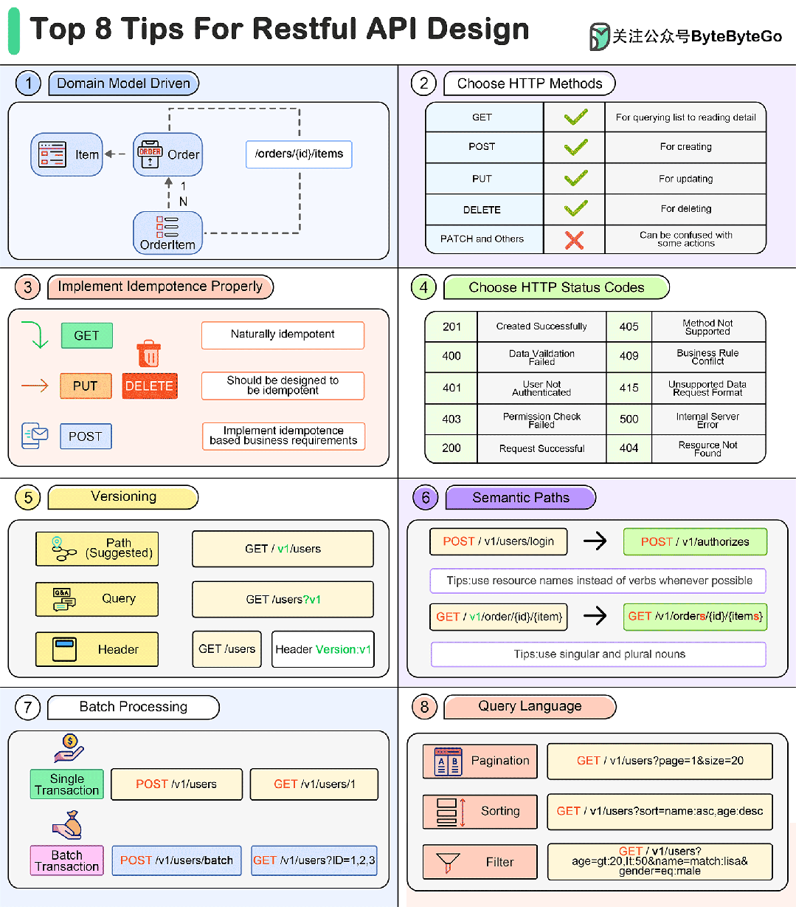

### 1 领域模型

在设计 RESTful API 的路径结构时，可以参考领域模型。在领域驱动设计思想中，领域模型构成了软件的逻辑结构。
这样设计有几个好处：

领域模型往往都是名词，和 API Path 保持一致。
领域模型往往为树形结构，可以很好地转换为 API Path。
团队成员能保持风格统一的 API 设计。

### 2 选择合适的 HTTP Methods

HTTP 协议提供了非常多种 Methods，但对于应用系统而言，使用过多的 HTTP Methods 会给开发者带来困扰。

因此，定义基本的几个 HTTP Methods 可以简化 API 设计，这取决于团队风格。

例如，PATCH 在很多时候会给团队造成困扰，开发者往往不能清晰地辨别在何种场景下使用 PATCH 还是 PUT，因此根据团队约定，可以统一使用
PUT。

### 3 幂等

提前进行幂等性设计可以提高 API 的健壮性。

GET 类型的 API 具有天然的幂等性，所以避免在 GET 类型的 API 中实现数据的变更操作。
PUT、DELETE 类型的 API 应该特别注意实现上尽量幂等，这样在 API 调用出错重试时不会带来意外的结果。
POST 为新增操作，理论上来说不应该实现为幂等，但在必要时可以通过输入参数设计为幂等。

### 4 选择合适的 HTTP 状态码

和 HTTP Methods 类似，HTTP 状态码也非常多。根据经验，开发者在选择使用哪一个状态码时，非常容易犯错，且难以在团队内达成统一。

比较好的方法是，定义有限的 HTTP 状态码来使用即可，来简化应用开发的难度。例如，当发生校验错误时，统一返回 400，当发生业务错误时，统一返回
419。

### 5 版本控制

提前为 API 设计版本号可以简化后期的改造和升级工作。

API 版本信息通常有三种方式：

使用 Path 前缀，将版本号放到 API Path 的前面。
使用 Query 参数。
使用 Header 参数。
比较推荐的方法是使用 Path 前缀，对于提供者和消费者来说都非常容易理解，且不会侵入其它的业务参数。

### 6 语义化 API 路径

让 API Path 保持语义化可以增加 API 的辨识度，让消费者更容易在文档中找到合适的 API。

提高语义化的方法有：

区分名词的单复数，避免错误单词拼写。
尽量使用资源名称代替动作。
如果实在无法避免动词，也尽可能将动词放到路径末尾，并使用 POST method。

### 7 批量处理

提前为批量 API 设定一套规则，让批量 API 更加语义化。我们可以进行约定：

使用 batch/bulk 作为关键字，放置到路径末尾。
当需要批量查询数据时，通过 Query 参数代替 Path 参数。

### 8 查询语言设计

提前设计一套具有拓展性的查询规则，可以让 API 更加灵活。

分页：预留分页参数关键字。
排序：预留排序参数关键字，以及排序的方向。例如通过 sort=name:asc,age:desc 表达根据名称正序，年龄倒序排序。
过滤：设置灵活的过滤条件语法，可以定义一些指令来实现更加灵活的过滤方式。例如，
```sh
GET /v1/users?age=gt:20,lt:50&name=match:lisa&gender=eq:male
```
其中，gt 代表大于，lt 代表小于，match 代表模糊搜索，eq 代表完全匹配。